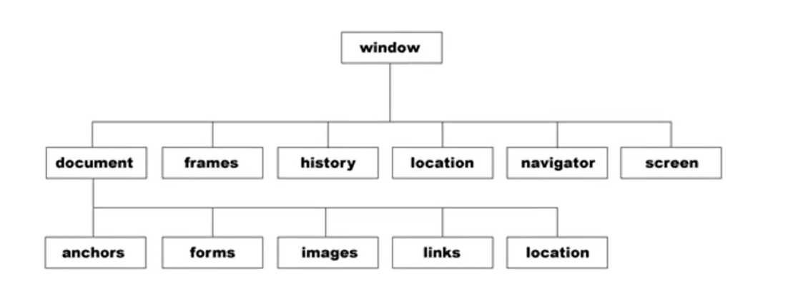

# javascript进阶
## 递归
**认识递归**

满足以下三个特点就是递归：
1. 函数自己调用自己
2. 一般情况有参数
3. 一般情况下有return

递归方法:
  1. 首先去找临界值，即无需计算，获得的值。
  2. 找这一次和上一次的关系
  3. 假设当前函数已经可以使用，调用自身计算上一次

一般情况不使用递归，使用递归会一次性开启很多内存，短时间开辟大量内存

```javascript
// 计算1~n的和？
function sum(n){
  var res = 0;
  for(var i = 1; i <= n; i++){
    res += i;
  }
  return res;
}
alert(sum(100));


// 递归方法计算1~n的和？
function sum(n){
  if(n == 1){
    return 1;
  }
  return sum(n - 1) + n;
}
alert(sum(100));
```

## 数组
### 认识数组
**数组：用一个变量存储一堆数据的数据结构。**
```javascript
声明数组：
1、通过new创建数组
参数：传入任意的数据，存储到数组中。   
var arr = new Array(100, true, "hello");       
2、省略new运算符创建数组
var arr = Array(100, true, "hello");

注:上述两种方法，传入参数只有一个，并且是数字的时候，直接声明这么长的一个数组。

3、数组常量进行赋值。（JS一般使用中括号[]）;
var arr = [100, true, "hello"];

声明长度为10的数组，数组中没有数据。
var arr = new Array(10);
var arr = Array(10);
```

```javascript
数组的属性：
数组.length  返回值数组【元素】的个数。

元素：将数组存储的每一个数据，叫做数组的元素。

访问数组的元素：
数组[下标]; 下标是从0开始的。


var arr = [100, true, "hello"];
alert(arr.length);  //3
alert(arr[1]);      //true
```

以下通过循环给数组每个元素赋值，随机数。
1. Math.random()  随机 [0,1)
2. parseInt(Math.random() * 10);  随机0~9的整数

```javascript
//1、长度是10的数组
var arr = new Array(10);
for(var i = 0; i < arr.length; i++){
  arr[i] = parseInt(Math.random() * 10);
}
  alert(arr);
```


### 数组遍历
三种方法：
1. for循环
2. for...in 遍历   快速遍历/快速枚举
3. forEach

在页面上分别将每一个数输出。
```javascript
//for循环
for(var i = 0; i < arr.length; i++){
  document.write(arr[i] + "<br/>");
}
//for...in循环
for(var i in arr){
  document.write(arr[i] + "<br/>");
}
```

```javascript
forEach
//第三种遍历数组的方法

arr.forEach(function(item, index, arr){
      // item当前遍历到的元素
      // index当前遍历到元素的下标
      // arr数组本身
    document.write(item + ", " + index + ", " + arr + "<br/>");
});
```


### 数组的方法
数组的方法：push、pop、shift、unshift、concat、slice、join(传入拼接符)、reverse(逆序)、sort(数组排序)

```javascript
栈结构：
结构：从同一头进，从同一头出。
特点：先进后出。

数组的两个方法形成栈结构：push pop

  push
    格式：数组.push(参数1, 参数2...);
    功能：给数组的末尾添加元素。
    返回值：插完元素以后数组的长度。

var arr = ["北京", "上海", "广州"];
var res = arr.push("深圳", "天津", "成都");
alert(arr);
alert(res);
```


```javascript
  pop
    格式：数组.pop()
    参数：没有参数
    返回值：取下一个元素
    功能：从数组末尾取下一个元素

var arr = ["北京", "上海", "广州"];
var res = arr.pop();
alert(res);
alert(arr);
```

```javascript
队列结构
结构：从末尾进，从头部出。
特点：先进先出

shift()
格式：数组.shift()
参数：没有参数
功能：从数组的头部取下一个元素
返回值：取下的元素

var arr = ["唐朝", "元朝", "清朝"];
var res = arr.shift();
alert(res);
alert(arr);
unshift()
```


```javascript
格式：数组.unshift(参数1, 参数2...)
功能：从数组的头部插入元素
返回值：插完元素以后数组的长度。

var arr = ["唐朝", "元朝", "清朝"];
var res = arr.unshift("隋朝", "商汤");
alert(res);
alert(arr);
```

```javascript
concat()
1、拷贝原数组生成新数组
2、合并数组
  格式：数组.concat(数组，数据...)
  返回值：合并成的新数组，原数组不会改变
  注：就算传入的是数组，数组中的元素要单独拆出来再进行合并

var arr1 = [10,20,30];
var arr2 = [50,60,70];
var newarr = arr1.concat(arr2,'hello',true)
alert(newarr);
alert(newarr.lenght);
alert(arr1);
```

```javascript
数组提取元素
格式：slice(start, end); (不会修改原数组）
功能：基于当前函数获取指定区域元素[start,end),含头不含尾，提取出元素生成新数组
返回值：生成新数组，原数组不会发生改变

var arr = [10,20,30,40,50,60];
var newarr = arr.slice(1,4);
alert(newarr); //20,30,40
alert(arr); //10,20,30,40,50,60
```

```javascript
splice()  增加，删除，修改
  格式:数组.splice(start, length, 数据1,数据2...);
  参数:
    start 开始截取的位置
    length 截取的元素的长度
    第三个参数开始:在start位置，插入的元素。
返回值:截取下来的元素组成的数组。

增加：
var arr = [10,20,30,40,50];
var res = arr.splice(2, 0, "hello", "world");
alert(arr);
alert(res);

删除：
var res = arr.splice(1, 2);
alert(arr); 
alert(res); 

修改：  (先删除，再增加)
var arr =[10, 20, 30, 40,50];
arr.splice(2, 1, "hello");
alert(arr);//10, 20, hello, 40,50
```

### ES5新增的数组语法
新增语法：indexof、数组遍历forEach、map映射、filter过滤、some某些、every每一个、reduce归并
```javascript
indexOf()
  格式：数组.index(item, start);
  参数： item 任意的数据  start 下标 可以不传入，默认是0
  功能：在数组中查找第一次出现item元素下标，从start开始去查找
  返回值： -1 没有查找到    >=0 查找到的元素的下标。

var arr = [10, 20, 30, 40, 50, 20, 30];
  var index = arr.indexOf(20, 2);
  alert(index); //5
```


```javascript
map() 映射

var arr = [10, 20, 30, 40, 50];
var newArr = arr.map(function(item, index, arr){
    //遍历要做的事情  映射关系
  return item * 1.3;
});
alert(newArr);
alert(arr); 
```


```javascript
filter() 过滤

var arr = [10, 20, 30, 40, 50];
var newArr = arr.filter(function(item, index, arr){
    //过滤的条件
    return item > 20;
});
alert(newArr);
alert(arr); 
```

```javascript
some  某些
【注】在数组中查找是否有符合条件的元素，有返回true，没有返回false。
短路操作：只要找到符合条件的元素，后面的循环就停止了。

var arr = [10, 20, 30, 40, 50];
var res = arr.some(function(item, index, arr){
    alert(item);//10,20,30 短路操作
    //过滤的条件
    return item > 20;
});
console.log(res);//true
console.log(arr); //[10, 20, 30, 40, 50]
```

```javascript
every 每一个
【注】在数组中查找每一个元素是否有符合条件，符合返回true，不符合返回false。
短路操作：只要找到不符合条件的元素，后面的循环就停止了。
                
var arr = [10, 20, 30, 40, 50];
var res = arr.every(function(item, index, arr){
    alert(item);
    //过滤的条件
    return item < 100;
});
alert(res);
alert(arr); 
```

### 二维数组
二维数组：人为起的，不是官方语法

数组存储数据，数组中每一个元素， 元素可以是任意的数据类型。

注：数组中的元素可以是数组。

```javascript
var arr1 = [10, 20, 30];
var arr = [true, 100, "hello", arr1];
alert(arr.length); //4
alert(arr[3] == arr1)  //true

alert(arr[3][1]);
alert(arr1[1])
//以上两个获取的相等
```


## 声明提升
**声明提升：在当前作用域，声明变量和函数，会直接提升在整个代码的最前面运行**

**预编译：在所有代码运行之前，计算机将代码从头到尾看一遍，将这个程序需要运行的空间一次性分配好**

```javascript
alert(num) //直接在控制台报错
```

```javascript
alert(num);  //undefined  声明提升了
var num = 10;
alert(num)   //10
```

```javascript
show(); //页面输出hello world  因为函数声明被提升了，把函数放在前面了
function show(){
  document.write('hello world')
}
```

```javascript
//局部作用域
function show(){
  alert(num);
  var num = 10;
  alert(num)
}
show();// undefined,10
alert(num); //直接报错
```

省略var，直接去强制给一个变量赋值，这个变量会被js强制声明声明成全局变量

注：不建议这样使用，这属于语法错误
```javascript
function show(){
  num = 10;//被声明成全局变量
  alert(num);
}
show();//10
alert(num);//10
```


## 冒泡排序
冒泡排序规则：前后两个数两两进行比较，如果符合交换条件就交换两个数位置

规律：冒泡排序每一轮排序，都可以找出一个较大的数，放在正确的位置。

```javascript
9, 8, 7, 6, 5, 4
  第一轮：五次
    9, 8, 7, 6, 5, 4
    8, 9, 7, 6, 5, 4
    8, 7, 9, 6, 5, 4
    8, 7, 6, 9, 5, 4
    8, 7, 6, 5, 9, 4
    8, 7, 6, 5, 4, 9

  第二轮：四次
    8, 7, 6, 5, 4
    7, 8, 6, 5, 4
    7, 6, 8, 5, 4
    7, 6, 5, 8, 4
    7, 6, 5, 4, 8

  第三轮：三次
    7, 6, 5, 4
    6, 7, 5, 4
    6, 5, 7, 4
    6, 5, 4, 7
                
  第四轮：两次
    6, 5, 4
    5, 6, 4
    5, 4, 6
                
  第五轮：一次
    5, 4
    4, 5

  分析：
    比较轮数 = 数组长度 - 1;
    每一轮比较的次数 = 数组长度 - 当前的轮数。
```

```javascript
var arr = [9, 8, 7, 6, 5, 4]; //从小到大

for (var i = 0; i < arr.length - 1; i++) {
//每一轮比较的次数
  for (var j = 0; j < arr.length - (i + 1); j++) {
    if (arr[j] > arr[j + 1]) {
      //交换两个数位置
      var tmp = arr[j];
      arr[j] = arr[j + 1];
      arr[j + 1] = tmp;
    }
  }
}
//4,5,6,7,8,9
alert(arr);
```

## 选择排序
选择排序(打擂台法)

    规则：选出一个位置，这个位置上的数，和后面所有的数进行比较，如果比较出大小就交换两个数位置。

    规律：每一轮都能选出一个最小的数，放在正确的位置。

```javascript
第一轮：5次
    9, 8, 7, 6, 5, 4
    8, 9, 7, 6, 5, 4
    7, 9, 8, 6, 5, 4
    6, 9, 8, 7, 5, 4
    5, 9, 8, 7, 6, 4
    4, 9, 8, 7, 6, 5

第二轮：4次
        9, 8, 7, 6, 5
        8, 9, 7, 6, 5
        7, 9, 8, 6, 5
        6, 9, 8, 7, 5
        5, 9, 8, 7, 6

第三轮： 
          9, 8, 7, 6
          8, 9, 7, 6
          7, 9, 8, 6
          6, 9, 8, 7

第四轮：         

              8, 9, 7
              7, 9, 8
第五轮：
                9, 8
                8, 9

比较的轮数 = 数组长度 - 1;
每一轮比较的次数 = 数组长度 - 当前的轮数
```

具体例子：
```javascript
var arr = [9, 8, 7, 6, 5, 4];

for(var i = 0; i < arr.length - 1; i++){
    //被比较的数的下标
    for(var j = i + 1; j < arr.length; j++){
        if(arr[i] > arr[j]){
            var tmp = arr[i];
            arr[i] = arr[j];
            arr[j] = tmp;
        }
    }
}
alert(arr);
```


## 字符串
### 认识字符串
**字符串概念：所有带单引号或者双引号的都叫做字符串。**

字符串声明：
1. 通过new运算符去声明字符串
2. 省略new声明字符串
3. 字符串常量赋值

```javascript
var str1 = new String(100);
// alert(str1 + 20);
alert(typeof str1); //object  对象 引用数据类型
var str2 = String(100);
// alert(str2 + 20);
alert(typeof str2); //string

var str3 = "100";
alert(typeof str3); //string
// alert(str3)
```

访问字符串中的字符：

    字符串.length  访问字符串中字符的个数。

    【注】中文 utf-8(三个字符表示一个汉字))  gbk(两个字符表示一个汉字)  在计数的时候都是当做一个汉字计数。

<br/>
访问字符串中单个字符：<br/>
    字符串.charAt(下标)  【注】从0开始的<br/>
    字符串[下标]<br/>

【注】字符串是只读，字符串一旦被声明就没有办法被修改，如果非要声明字符串，我们只能讲原字符串效果，重新生成新的字符串。<br/>
【注】在JS中，字符串既是基本数据类型，又是复合数据类型。<br/>

```javascript
var str = "hello北京";
//  alert(str.length);
// alert(str.charAt(4));
alert(str[4]);
str[4] = "x";
alert(str);//没办法修改
```


### 字符串的方法
**charCodeAt字符串ASCII码值、fromCharCodeASCII码值字符**<br/>
**indexOf查找字符第一次出现的位置、lastIndexOf查找字符最后出现的位置、search**<br/>
**substring、substr提取字符串、replace替换字符串、split字符串分割**<br/>


charCodeAt()<br/>
    格式：字符串.charCodeAt(下标)<br/>
    功能：访问字符串中对应下标字符的ASCII码值。<br/>


String.fromCharCode();<br/>
    格式：String.fromCharCode(码值1, 码值2...);<br/>
    功能：将传入的ASCII码值转成对应的字符<br/>
    返回值：组成的字符串<br/>

```javascript
var str = "hello";
alert(str.charCodeAt(1));

var str = String.fromCharCode(97, 98, 99, 100);
alert(str);
```

indexOf()<br/>
    格式：supStr.indexOf(subStr, start);<br/>
    参数：第一个参数，查找的字符串<br/>
          start 从哪个下标开始去查找，如果不传入，默认从下标0开始查找<br/>
    功能：在supStr中查找subStr第一次出现的位置，从start这个位置开始查找。<br/>
    返回值：-1  说明没有查找到<br/>

```javascript
var supStr = "abcabcabc";
var subStr = "abc";

var index = supStr.indexOf(subStr, 4);
alert(index);//6
```


lastIndexOf()<br/>
    格式：supStr.lastIndexOf(subStr, start);<br/>
    功能：在supStr中查找subStr最后一次出现的位置<br/>
    参数：第二个参数是开始查找的位置，查找的下标是从右往左数的。<br/>
    返回值： -1 没有查找到<br/>

```javascript
var supStr = "abcabcabc";
var subStr = "abc";

var index = supStr.lastIndexOf(subStr, 4);
alert(index);//3
```

search：
```javascript
search()
    格式：supStr.search(subStr);
    参数：字符串/正则表达式
    功能：在supStr中查找subStr第一次出现的位置
    返回值： -1 没有查找到

正则表达式：
    修饰符： i 忽略大小写   g 全局匹配

var supStr = "Abcabcabc";
//var subStr = "abc";
var subStr = /abc/i;

var index = supStr.search(subStr);
alert(index); //0
```

substring<br/>
    格式：字符串.substring(start, end);<br/>
    功能：将字符串中 [start,end) 提取这部分字符，生成一个新字符串<br/>
    返回值：新生成的字符串<br/>

substr<br/>
    格式：字符串.substr(start, length);<br/>
    返回值：新生成的字符串<br/>

slice(是数组)<br/>
    格式：字符串.slice(start, end);<br/>

```javascript
var str = "hello";
//var newStr = str.substring(1, 4);
//var newStr = str.substr(1, 3);
//var newStr = str.slice(1, 4);  以上三者输出结果一样
alert(newStr);
alert(str);
```

replace:
```javascript
replace()
    格式：supStr.replace(oldStr, newStr);
    功能：用newStr将oldStr，替换掉，生成新字符串。
    参数：
        第一个参数传入的是字符串只能替换一次。
        第一个参数  正则表达式
            /xxx/ig    i忽略大小   g全局匹配
    返回值：替换成的新字符串。


var str = "how are aRe are you";
var newStr = str.replace("are", "old are");
var newStr = str.replace(/are/gi, "old are");
alert(newStr);
alert(str);
```


```javascript
split()  字符串分割
    格式：字符串.split(分割符, length)
    参数：
        第一个参数，用这个分割符对原字符串进行分割
        第二个参数，控制返回的数组的元素格式，一般情况下不用。
    功能：用分割符对原字符串，进行字符串分割，将分割完毕以后的子串，放在数组中返回。
    返回值：数组

注意：
    1、相邻的两个分割符，会产生空字符串  ""
    2、分割符是空字符串"",直接将每一个字符，单独分割成子串，放在数组中返回

var str = "how  are you";
// var arr = str.split(" ", 2);
var arr = str.split(" ");
alert(arr); //how,"",are,you
alert(str); //how are you */

  var str = "how are you";
var arr = str.split("");
alert(arr); //h,o,w, ,a,r,e, ,y,o,u 
```

## 随机验证码

随机0~9的验证码
```javascript
//n位验证码  每一个数字的范围 0~9   parseInt(Math.random() * 10);
function numTestCode(n){
  var arr = []; //存储生成的数字
  for(var i = 0; i < n; i++){
    var num = parseInt(Math.random() * 10);
    arr.push(num);
  }
  return arr.join("");
}
alert(numTestCode(6));
```

随机0~9及大小写字母
```javascript
function testCode(n){
  var arr = [];
  for(var i = 0; i < n; i++){
    var num = parseInt(Math.random() * 123);
    if(num >= 0 && num <= 9){
        arr.push(num);
    }else if(num >= 97 && num <= 122 || num >= 65 && num <= 90){
        arr.push(String.fromCharCode(num));
    }else{
        i--;
    }
  }

  return arr.join("");
}

alert(testCode(6));
```


## 敏感词过滤
敏感词过滤

>表单元素，获取其中内容，通过.value的属性
>双标签节点 innerHTML属性，获取标签间内容，设置标签间内容，如果文本中含有标签，会自动解析。

```javascript
要求：
    1、敏感词都过滤  正则表达式
    2、将敏感词替换成*
    replace()
```

```javascript
<style>
    #msg{width: 400px; height: 400px; border: 1px solid black}
</style>

<body>
    <textarea name="" id="txt1" cols="30" rows="10"></textarea>
    <button onclick = 'btnClick();'>发布</button>
    <div id = 'msg'></div>
</body>

<script>
var arr = [/靠/ig, /tmd/ig, /nm/ig];
function btnClick(){
    var oTxt = document.getElementById("txt1");
    var oMsg = document.getElementById("msg");

    var oValue = oTxt.value;
    for(var i = 0; i < arr.length; i++){
        oValue = oValue.replace(arr[i], "*");
    }

    //把textarea内的内容放在div上
    oMsg.innerHTML = oValue;
    //把textarea内容清空
    oTxt.value = '';
}
</script>
```

## 事件驱动函数
onclick 点击<br/>
onblur 失去焦点<br/>

## 事件
### 认识事件

1. 发展历史<br/>
    编程语言：汇编、C语言   面向过程语言<br/>
    编码语言：Java、C++、JavaScript、Object-C、python  面向对象语言<br/>

2. 思想<br/>
    面向过程编程思想：只考虑数学逻辑。<br/>
    面向对象编程思想：直接将生活逻辑映射到我们的程序。<br/>
      <1>分析有哪些实体<br/>
      <2>设计实体属性和功能<br/>
      <3>实体之间相互作用<br/>


3. 语法（在JavaScript中没有类这个概念，只有对象，ECMA6版新增了类的概念）<br/>
  类：一类具有相同特征事物的抽象概念。<br/>
  对象：具体某一个个体，唯一的实例。<br/>

  类   狗   电脑<br/>
  对象  你遇到的那只狗   你的电脑<br/>

4. 数据结构<br/>
   基本数据类型(存储一个值) =>  数组(处理批量的数据) => 对象(既可以存储数据又可以存储函数)<br/>

例子：<br/>
  有一辆车速度60km/h，一条路1000km，问题：如果让这辆车跑完这条路，需要多长时间？<br/>


```javascript
//面向过程编程思想
var hours = 1000 / 60;
alert(hours);


//  面向对象的编程思想
车
    属性：
        speed 60km/h
    功能：
        可以跑在路上

路
    属性:
        length 1000km
最后，让车真的跑在路上得出结果。


var car = {
    speed: 60,
    run: function(road){
        return road.length / car.speed;
    }
};

var kuahaidaqiao = {
    length: 1000
};

var hours = car.run(kuahaidaqiao);
//数字.toFixed(n)  保留n为小数的
alert("一共花了" + hours.toFixed(2) + "小时");
```

## Math对象
在JS中一切皆对象。<br/>
在JS，很多关系数学运算的函数，直接一个Math对象提供。<br/>

```javascript
Math.random() //返回0-1之间的随机数
Math.max(num1, num2) //返回较大的数
Math.min(num1, num2)  //返回较小的数
Math.abs(num)  //绝对值
Math.round() 四舍五入(成整数，只看小数点后一位)
Math.ceil(19.3)  //向上取整
Math.floor(11.8)  //向下取整
Math.pow(x,y)  //x的y次方
Math.sqrt(num)  //开平方
```

## 定时器
定时器<br/>
  格式：var timer = setInterval(函数, 毫秒数);<br/>
  功能：每隔对应的毫秒数，执行一次传入的函数。<br/>
  返回值：启动定时器的，系统分配的编号。<br/>

  clearInterval(timer);  取消定时器<br/>

```javascript
var i = 0;
function show(){
    if(i == 5){
        clearInterval(timer);
    }
    document.write(i++ + "<br/>");
}


var timer = setInterval(show, 1000);
```

简化写法：
```javascript
一般情况下，将没有名字的函数叫做匿名函数。

var timer = setInterval(匿名函数, 毫秒数);
var timer = setInterval(function(){
    执行代码;
}, 毫秒数);


var i = 0;
var timer = setInterval(function(){
    if(i == 5){
        clearInterval(timer);
    }
    document.write(i++ + "<br/>");
}, 1000);
```


## BOM
**BOM：浏览器对象模型(browser object model)**<br/>
每一个窗口都是一个BOM


系统对话框：
```javascript
系统对话框
    window 方法 (一般情况下window可以省略)

    alert() 弹出警告框
    confirm() 弹出一个带确定和取消的提示框
        返回值：如果点击确定，返回true
                如果点击取消，返回false

    prompt() 弹出一个带输入框的提示框
        参数：
            第一个参数：面板上显示的内容
            第二个参数：输入框里面的默认（可以不传入）
        返回值：点击确定，返回输入框中的内容
                点击取消，返回null。
```
oppo方法：
```javascript
<script>
    open()
        第一个参数：跳转的url  打开一个新窗口，加载url
        第二个参数：字符串，给打开的窗口起一个名字
        第三个参数：一串特殊含义的字符串，可以控制打开窗口的属性

function btnClick(){
    // window.open()
    open("https://www.baidu.com", "xxx", 'width=400,height=400,top=200,left=300,scrollbars=yes');
}
</script>

<body>
<button onclick = 'btnClick();'>打开窗口</button>
</body>
```

### history对象
history对象： 掌管的是，**当前窗口(注意不是浏览器)历史记录**(只要加载url不一样就会产生历史记录)
中式英语：嘿死追

history对象：
```javascript
属性 
    history.length 输出当前窗口历史记录的条数
方法
    history.back()  返回上一条历史记录
    history.forward() 前进到下一条历史记录
    history.go()
        参数： 0  刷新当前页面
              正整数 前进n条记录
              负整数 后退n条记录


<button onclick = 'alert(history.length);'>获取历史记录的条数</button>
<button onclick = 'history.back();'>back</button>
<button onclick = 'history.forward();'>forward</button>
<button onclick = 'history.go(2)'>go</button>
```


### location
location  地址栏<br/>
中式英语：落k神<br/>


url：统一资源定位符。<br/>
中文版本：<br/>
协议://IP(域名)/:端口号/路径/?查询字符串#锚点<br/>
英文版本：<br/>
protocol://hostname:port/pathname/?search#hash<br/>


location 对象属性
```javascript
location.protocol   file:本地磁盘文件访问
                    http：
                    https：证书认证协议

location.hostname   主机名：ip (在全球范围内找到你当前网络地址)
                          域名 就是 ip的别称

location.port       端口号(默认隐藏的)
注：是当前电脑中使用网络的软件，随机给他分配一个编号 0~65535

location.pathname   路径

location.search     查询字符串

location.hash       锚点
```

location 对象方法
```javascript
方法：
    location.assign(url)
    【注】在当前窗口跳转带这个url
    location.replace(url)
    【注】在当前窗口替换成新的url。不会产生历史记录。
    location.reload()
    【注】刷新窗前窗口
    location.reload(true)   不经过浏览器缓存强制从服务器重载

<button onclick = "location.assign('https://www.baidu.com')">assign</button>
<button onclick = "location.replace('https://www.baidu.com')">replace</button>
<button onclick = 'location.reload(true)'>reload</button>
```


## DOM
**DOM： document object model(文档对象模型)**

### 元素节点的获取

```javascript
节点类型：
  元素节点  <div></div>
  属性节点  id = 'div1'
  文本节点  div文本

<div id = 'div1' title = 'hello' class = 'box' style = 'width: 300px;  background-color: red'>div文本</div>
```


```javascript
元素节点的获取
document.getElementById(id)
功能：通过id获取符合条件的元素，（id必须是唯一的）
返回值：就是符合条件的一个节点。

node.getElementsByTagName(标签名);
功能：从node节点开始，通过标签名获取符合条件的元素节点。
返回值：伪数组/类数组

node.getElementsByClassName(class名字)   （IE8以下不兼容）
功能：通过class名字获取符合条件的元素节点。

document.getElementsByName(name属性的值);
功能：通过name属性的值获取符合条件的元素节点。
【注】一般使用在表单元素里。
```

### 获取当前有效样式
通过.style.xxx的方式只能访问内联的css样式。<br/>
系统提供了两个方法(不同的浏览器)<br/>

```javascript
alert(oDiv.currentStyle['height']);  //IE兼容
alert(getComputedStyle(oDiv)["height"]); //火狐、谷歌

//跨浏览器的兼容
function getStyle(node, cssStyle){
    return node.currentStyle ? node.currentStyle[cssStyle] : getComputedStyle(node)[cssStyle];
}
```


### attribute
中式英文：o吹biu
```javascript
setAttribute //添加属性
getAttribute //获取属性
removeAttribute() //删除属性
```

### 元素节点属性
```javascript
innerHTML  获取标签间内容  会解析标签
innerText  获取标签间纯文本  不会解析标签，设置纯文本
outerHTML  从外标签开始到外标签结束   会解析标签
```

### 获取子节点
```javascript
childNodes   访问当前节点下所有的子节点
firstChild   访问子节点中的首位
lastChild    访问子节点中的最后一位
nextSibling  访问当前节点兄弟节点中的下一个节点
previousSibling  访问当前节点兄弟节点中的上一个节点

【注】上述这些属性都包含文本节点


【注】下述这些方法只获取子节点中的元素节点。(IE8以下不兼容)

children
firstElementChild
lastElementChild
nextElementtSibling
previousElementSibling


                nodeType     nodeName    nodeValue
        元素节点     1          标签名         null
        属性节点     2          属性名       属性值
        文本节点     3          #text       文本内容


   空格、回车、换行 看不见，是字符。  

<div id = 'div1'>
  <em>em文本</em>
  div文本
  <strong>strong文本</strong>
</div>
```