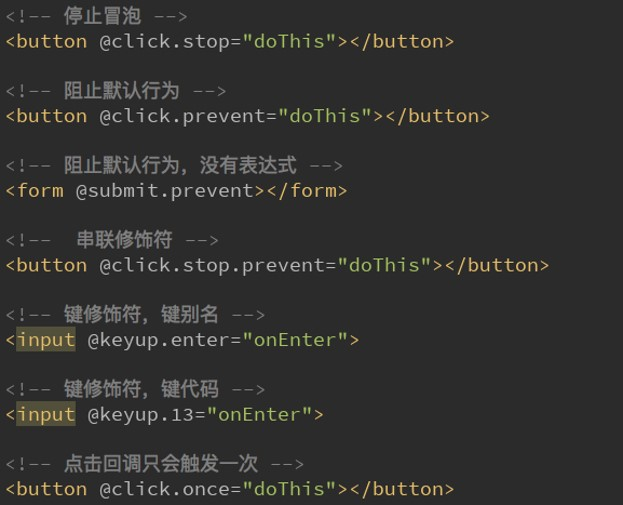

## 插值操作
**v-once**<br/>
不希望它响应可以用这个<br/>
该指令后面不需要跟任何表达式<br/>
该指令表示元素和组件只渲染一次，不会随着数据的改变而改变。<br/>

message发生改变，界面并没有重新渲染<br/>


**v-html**<br/>
我们从服务器请求到的数据本身就是一个HTML代码<br/>
如果我们直接通过{{}}来输出，会将HTML代码也一起输出。<br/>
但是我们可能希望的是按照HTML格式进行解析，并且显示对应的内容。<br/>
我们希望解析出HTML展示，可以使用v-html指令<br/>


**v-text**<br/>
一般不用<br/>


**v-pre**<br/>
v-pre用于跳过这个元素和它子元素的编译过程，不会解析<br/>


## 属性绑定
除了内容需要动态来决定外，某些属性我们也希望动态来绑定。<br/>
比如动态绑定a元素的href属性<br/>
比如动态绑定img元素的src属性<br/>
v-bind用于绑定一个或多个属性值，或者向另一个组件传递props值<br/>


### 动态绑定class

很多时候，我们希望动态的来切换class，比如：
1. 当数据为某个状态时，字体显示红色。
2. 当数据另一个状态时，字体显示黑色。

绑定class有两种方式：
1. 对象语法
2. 数组语法

对象语法的含义是:class后面跟的是一个对象
```javascript
<h2 :class="{'类名1': Boolean, '类名2': Boolean}">Hello World</h2>
<h2 :class="{'active': isActive, 'line': isLine}">Hello World</h2>
//在data里面进行判断
//如果内容太长了，可以定义一个方法
<h2 :class="getClass()">hello world</h2>

methods:{
  getClass:function(){
    return {'active': this.isActive, 'line': this.isLine}
  }
}
```

数组语法的含义是:class后面跟的是一个数组<br/>
用得不多
```javascript
<h2 :class="['active', 'line']">Hello World</h2>

```

### 动态绑定style
我们可以利用v-bind:style来绑定一些CSS内联样式

绑定class有两种方式：
1. 对象语法
2. 数组语法


```javascript
<h2 :style="{key(属性名): value(属性值)}">hello world </h2>
<h2 :style="{font-size: finalSize}">hello world </h2>
data:{
  finalSize:'100px'
}
```


## 计算属性属性属性
在某些情况，我们可能需要对数据进行一些转化后再显示，<br/>
或者需要将多个数据结合起来进行显示，此时就会用到计算属性<br/>

如下图：


**计算属性和methdos对比**
计算属性会进行缓存，如果多次使用时，计算属性只会调用一次。<br/>
computed具有缓存性，基于依赖进行缓存的，只有相关的依赖发生改变才会重新缓存<br/>
在我们处理大量数据的时候使用可以大大提高效率<br/>
计算过程过于庞杂，而且会经常被调用的话，就使用计算属性<br/>

methods只有在调用的时候才会执行对应的方法，结果不会缓存，重新渲染时，会重新调用执行<br/>

computed的性能比methods更高<br/>


## v-on事件监听

前端开发中，我们需要经常和用于交互。<br/>
须监听用户发生的时间，比如点击、拖拽、键盘事件等等<br/>
在Vue中如何监听事件呢？使用v-on指令<br/>

### v-on的基本使用

` v-on介绍 `绑定事件监听器<br/>
语法糖： @<br/>
参数：event<br/>

```javascript
<body>
  <div id="app">
    <h2>{{counter}}</h2>
    <button v-on:click='add'>+</button>
    <button v-on:click='ajj'>-</button>
  </div>
</body>
<script src="vue.js"></script>
<script>
  const app = new Vue({
    el:'#app',
    data:{
      counter:0,
    },
    methods:{
      //注意：此处使用data里的数据，必须使用this
      add(){
        this.counter++;
      },
      ajj(){
        this.counter--;
      }
    }
  })
</script>
```

### v-on参数传递问题

1. 如果该方法不需要额外参数，那么方法后的()可以不添加
2. 如果方法本身中有一个参数，那么会默认将原生事件event参数传递进去
3. 如果需要同时传入某个参数，同时需要event时，可以通过$event传入事件。

```javascript

<div id="app">
  //1.事件调用的方法没有参数
  <button @click="btn1Click()">按钮1</button>
  <button @click="btn1Click">按钮1</button>

  //2.在事件定义时, 写方法时省略了小括号, 但是方法本身是需要一个参数的, 这个时候, Vue会默认将浏览器生产的event事件对象作为参数传入到方法
  //<button @click="btn2Click(123)">按钮2</button>
  //<button @click="btn2Click()">按钮2</button>
  <button @click="btn2Click">按钮2</button>

  //3.方法定义时, 我们需要event对象, 同时又需要其他参数-
  // 在调用方式, 如何手动的获取到浏览器参数的event对象: $event
  <button @click="btn3Click(abc, $event)">按钮3</button>
</div>

<script src="../js/vue.js"></script>
<script>
  const app = new Vue({
    el: '#app',
    data: {
      message: '你好啊',
      abc: 123
    },
    methods: {
      btn1Click() {
        console.log("btn1Click");
      },
      btn2Click(event) {
        console.log('--------', event);
      },
      btn3Click(abc, event) {
        console.log('++++++++', abc, event);
      }
    }
  })

  // 如果函数需要参数,但是没有传入, 那么函数的形参为undefined
  // function abc(name) {
  //   console.log(name);
  // }
  //
  // abc()
```


### v-on修饰符




## 条件判断

>v-if
>v-if、v-else
>v-if、v-else-if、v-else


v-if、判断isShow的布尔值判断显示
```javascript
<body>
  <div id="app">
    <h2 v-if=isShow>{{message}}</h2>
  </div>
</body>

<script>
  const app = new Vue({
    el:'#app',
    data:{
      message:'hello world',
      isShow:true
    }
  })
</script>
```

v-if为false是显示v-else
```javascript
<body>
  <div id="app">
    <h2 v-if=isShow>{{message}}</h2>
    <h2 v-else>v-if为false时显示我</h2>
  </div>
</body>

<script>
  const app = new Vue({
    el:'#app',
    data:{
      message:'hello world',
      isShow:true
    }
  })
</script>
```

v-if、v-else-if、v-else结合使用

```javascript
<body>
  <div id="app">
    <h2 v-if='score>=90'>优秀</h2>
    <h2 v-else-if='score>=75'>良好</h2>
    <h2 v-else-if='score>=60'>及格</h2>
    <h2 v-else>不及格</h2>
  </div>
</body>
<script src="vue.js"></script>
<script>
  const app = new Vue({
    el:'#app',
    data:{
      score:55
    }
  })
```


