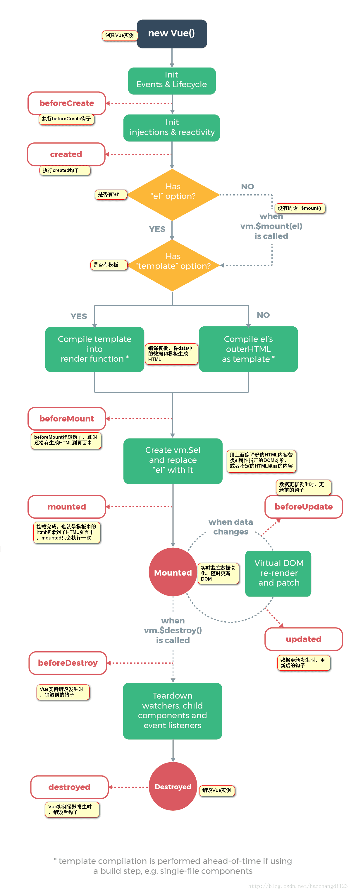
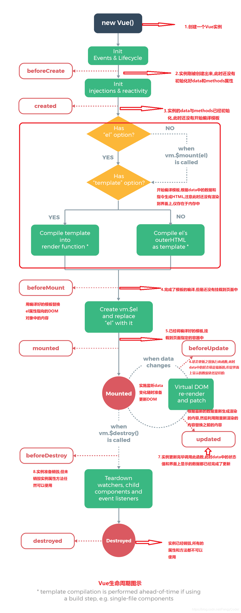

# vue的生命周期
什么是生命周期?<br/>
简而言之:从生到死的过程,从Vue实例创建-运行-销毁的过程<br/>
Vue实例有一个完整的生命周期，也就是从开始创建、初始化数据、编译模板、挂载Dom、渲染→更新→渲染、销毁等一系列过程<br/>
生命周期方法?<br/>
Vue从生到死的过程中伴随着各种各样的事件,这些事件会自动触发一些方法.这些方法我们统称为生命周期方法<br/>
生命周期钩子 = 生命周期函数 = 生命周期事件<br/>

```javascript
创建期间生命周期方法
beforeCreate
created
beforeMount
mounted

运行期间生命周期方法
beforeUpdate
updated

销毁期间的生命周期方法 
beforeDestroy 
destroyed
```

```javascript
<!DOCTYPE html>
<html lang="en">
<head>
    <meta charset="UTF-8">
    <title>Vue生命周期方法</title>
    <!--引入vue框架-->
    <script src="js/vue.js"></script>
</head>
<body>
<div id="app">
    <p>{{msg}}</p>
</div>
<script>
    let vm = new Vue({
        el:'#app',
        data:{
            msg:"IT程序员的日常"
        },
        methods:{
            say:function () {
                console.log("IT程序员的日常");
            }
        },
        beforeCreate:function () {
            /*执行beforeCreate的时候,表示Vue刚刚出生,还没有任何内容,data/methods都没有初始化*/
            //console.log(this.msg);
            //this.say();
            //console.log(this.say);
        },
        created:function () {
            /*执行created的时候,表示Vue实例已经初始化好了部分内容,data/methods
            想在Vue实例中最早访问到data/methods,只有在这个方法才能访问*/
            //console.log(this.msg);
            //this.say();
            // console.log(this.say);
        },
        beforeMount:function () {
            /*执行beforeMount,表示已经根据数据编译好了模板,但是还没有渲染到界面上*/
            // console.log(document.querySelector("p").innerText);
            // console.log(document.querySelector("p").innerHTML);
        },
        mounted:function () {
            /*执行mounted,表示已经根据数据编译好了模板,已经将模板有渲染到界面上,此时可以对界面进行其他操作了*/
            console.log(document.querySelector("p").innerText);
            console.log(document.querySelector("p").innerHTML);
        },
        beforeUpdate:function(){
            /*主要data中的数据发生了变化就会执行
            执行beforeUpdate时候,data的数据已经是最新的了,但是没有更新界面上的数据*/
            // console.log(this.msg);
            // console.log(document.querySelector("p").innerText);
            // console.log(document.querySelector("p").innerHTML);
        },
        updated:function () {
            /*主要data中的数据发生了变化就会执行
           执行updated时候,data的数据已经是最新的了,界面上的数据也已经更新*/
            console.log(this.msg);
            console.log(document.querySelector("p").innerText);
            console.log(document.querySelector("p").innerHTML);
        },
         beforeDestroy:function(){
            /*执行beforeDestroy的时候,表示Vue实例即将销毁,但是还未销毁,实例中的数据等都可以使用
             最后能使用Vue实例的地址*/
            
        },
        destroyed:function () {
            /*执行destroyed的时候,表示vue实例完全销毁,实例中的任何内容都不能被使用了*/
        }
    })
</script>
</body>
</html>
```

```javascript
//生命周期：初始化阶段 运行中阶段 销毁阶段
    Vue.component("aaa",{
        template:"#aaa",
        data:function(){
            return {msg:'hello'}
        },
        timer:null,
        methods:{
            destroy:function(){
                this.$destroy()//
            }
        },
        beforeCreate:function(){
            console.log('beforeCreate:刚刚new Vue()之后，这个时候，数据还没有挂载呢，只是一个空壳')           
            console.log(this.msg)//undefined
            console.log(document.getElementsByClassName("myp")[0])//undefined
        },
        created:function(){
            console.log('created:这个时候已经可以使用到数据，也可以更改数据,在这里更改数据不会触发updated函数')
            this.msg+='!!!'
            console.log('在这里可以在渲染前倒数第二次更改数据的机会，不会触发其他的钩子函数，一般可以在这里做初始数据的获取')
            console.log('接下来开始找实例或者组件对应的模板，编译模板为虚拟dom放入到render函数中准备渲染')
        },
        beforeMount:function(){
            console.log('beforeMount：虚拟dom已经创建完成，马上就要渲染,在这里也可以更改数据，不会触发updated')
            this.msg+='@@@@'
            console.log('在这里可以在渲染前最后一次更改数据的机会，不会触发其他的钩子函数，一般可以在这里做初始数据的获取')
            console.log(document.getElementsByClassName("myp")[0])//undefined
            console.log('接下来开始render，渲染出真实dom')
        },
        // render:function(createElement){
        //     console.log('render')
        //     return createElement('div','hahaha')
        // },
        mounted:function(){ 
            console.log('mounted：此时，组件已经出现在页面中，数据、真实dom都已经处理好了,事件都已经挂载好了')
            console.log(document.getElementsByClassName("myp")[0])
            console.log('可以在这里操作真实dom等事情...')
        //    this.$options.timer = setInterval(function () {
        //        console.log('setInterval')
        //         this.msg+='!'  
        //    }.bind(this),500)
        },
        beforeUpdate:function(){
            //这里不能更改数据，否则会陷入死循环
            console.log('beforeUpdate:重新渲染之前触发')
            console.log('然后vue的虚拟dom机制会重新构建虚拟dom与上一次的虚拟dom树利用diff算法进行对比之后重新渲染')         
        },
        updated:function(){
            //这里不能更改数据，否则会陷入死循环
            console.log('updated:数据已经更改完成，dom也重新render完成')
        },
        beforeDestroy:function(){
            console.log('beforeDestory:销毁前执行（$destroy方法被调用的时候就会执行）,一般在这里善后:清除计时器、清除非指令绑定的事件等等...')
            // clearInterval(this.$options.timer)
        },
        destroyed:function(){
            console.log('destroyed:组件的数据绑定、监听...都去掉了,只剩下dom空壳，这里也可以善后')
        }
    })
```
图解：
<br/><br/><br/><br/><br/><br/><br/><br/>
<br/>

比较常用的生命周期函数
```javascript
created  用于网络请求  苦A托
```

